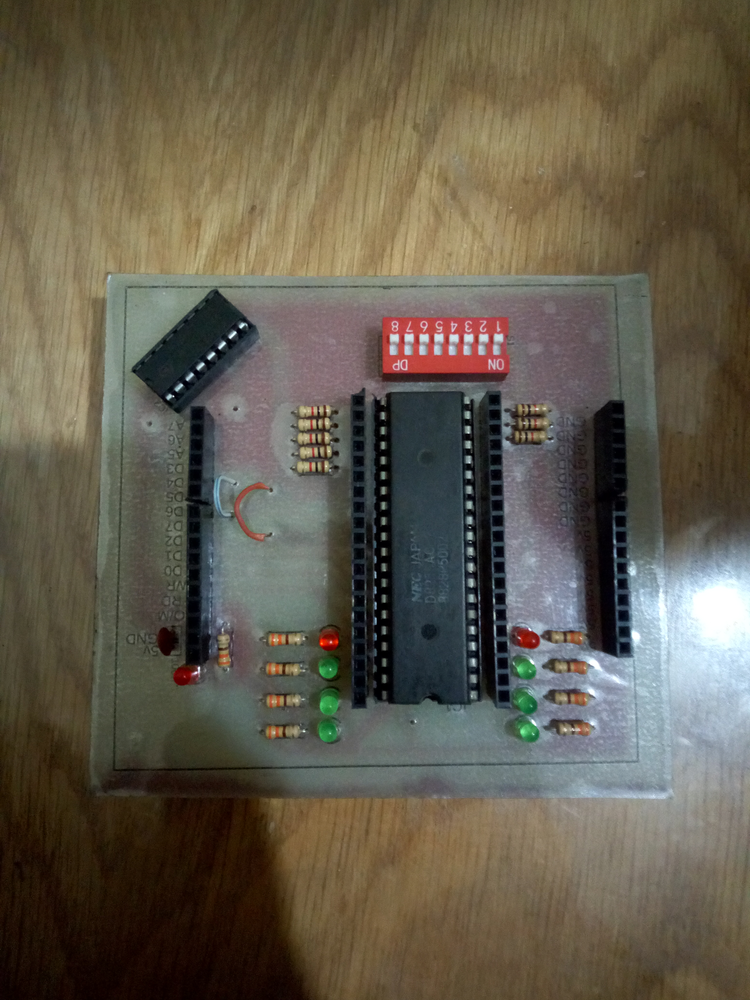

# 8088-motherboard
This is the full design files for the  20x20 cm^2 8088 motheboard project.

The project aims to uplaoad a code on the flash memories of the intel 8088 micro processor  with 8051 controller. In addtion input outpu module addes to test inputs.

The motherboard consists of 5 parts:

1. The motherboard it self with the 8088 in its center. 
2. The 80851 module.
3. The input output module.
4. two memories.

# Table of Content

* [Full desing](#Full-Desing)
* [8088 Motherboard](##8088-Motherboard)
* [8051 Module](##8051-Module)
* [Input Output Module](##Input-Output-Module)
* [Memories](##Memories)

## Full Desing

## 8088 Motherboard

## 8051 Module

## Input Output Module

## Memories 

